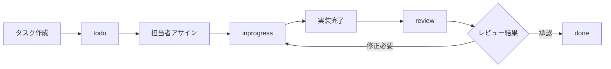

# TaskHub MCP 使用方法ガイド

## 目次
1. [基本概念](#基本概念)
2. [タスクの作成](#タスクの作成)
3. [タスクの管理](#タスクの管理)
4. [タスクワークフロー](#タスクワークフロー)
5. [Claude Codeでの使用](#claude-codeでの使用)
6. [高度な使用方法](#高度な使用方法)
7. [ベストプラクティス](#ベストプラクティス)

## 基本概念

### タスクとは
TaskHub MCPにおけるタスクは、以下の要素を持つ作業単位です：
- **一意のID**: UUID形式の識別子
- **ステータス**: todo, inprogress, review, done
- **Markdownファイル**: タスクの詳細内容
- **メタデータ**: 作成日時、更新日時、担当者など

### Gitネイティブアプローチ
- すべてのタスクはMarkdownファイルとして保存
- Gitで完全な変更履歴を追跡
- ブランチごとに異なるタスクセットを管理可能

## タスクの作成

### 方法1: API経由での作成

```bash
curl -X POST http://localhost:8000/tasks/create \
  -H "Content-Type: application/json" \
  -d '{
    "title": "ユーザー認証機能の実装",
    "content": "## 概要\nJWT認証を使用したユーザー認証機能を実装する\n\n## 要件\n- ログイン/ログアウト\n- トークンリフレッシュ\n- セッション管理"
  }'
```

### 方法2: Claude Code経由での作成

Claude Code内で以下のツールを使用：

```
「新しいタスクを作成してください」
→ mcp__taskhub__create_task_with_file_tasks_create_post ツールが使用されます
```

### 方法3: 手動でMarkdownファイルを作成

1. `tasks/`ディレクトリに新しいMarkdownファイルを作成：

```markdown
---
title: バックエンドAPIの最適化
status: todo
created_at: 2025-06-21T14:00:00
updated_at: 2025-06-21T14:00:00
assignee: claude
tags: [performance, backend]
---

# バックエンドAPIの最適化

## 目的
レスポンス時間を50%短縮する

## タスク詳細
1. 現在のパフォーマンスボトルネックを特定
2. キャッシング戦略の実装
3. データベースクエリの最適化

## 受け入れ基準
- [ ] レスポンス時間が50%短縮されている
- [ ] 負荷テストに合格
- [ ] ドキュメントが更新されている
```

2. APIで同期を実行：

```bash
curl -X POST http://localhost:8000/tasks/sync
```

## タスクの管理

### タスク一覧の取得

#### すべてのTODOタスク
```bash
curl http://localhost:8000/tasks?status=todo
```

#### 進行中のタスク
```bash
curl http://localhost:8000/tasks?status=inprogress
```

#### Claude Code内での取得
```
「現在のタスク一覧を表示してください」
→ mcp__taskhub__list_tasks_tasks_get ツールが使用されます
```

### タスクの詳細確認

```bash
# タスクIDを指定して詳細を取得
curl http://localhost:8000/tasks/file/{task_id}
```

レスポンス例：
```json
{
  "id": "a1b2c3d4-e5f6-7890-abcd-ef1234567890",
  "status": "inprogress",
  "file_path": "implement-auth.md",
  "title": "ユーザー認証機能の実装",
  "content": "# ユーザー認証機能の実装\n\n## 概要\n...",
  "created_at": "2025-06-21T14:00:00",
  "updated_at": "2025-06-21T15:30:00",
  "assignee": "claude"
}
```

### ステータスの更新

#### APIでの更新
```bash
# 進行中に変更
curl -X PUT http://localhost:8000/tasks/{task_id}/status \
  -H "Content-Type: application/json" \
  -d '{"new_status": "inprogress"}'

# レビュー待ちに変更
curl -X PUT http://localhost:8000/tasks/{task_id}/status \
  -H "Content-Type: application/json" \
  -d '{"new_status": "review"}'

# 完了に変更
curl -X PUT http://localhost:8000/tasks/{task_id}/status \
  -H "Content-Type: application/json" \
  -d '{"new_status": "done"}'
```

#### Claude Codeでの更新
```
「タスク {task_id} を進行中に変更してください」
→ mcp__taskhub__update_task_status_tasks__task_id__status_put ツールが使用されます
```

## タスクワークフロー

### 典型的なワークフロー



### 実例：機能開発タスク

1. **タスク作成**
```bash
# プロダクトマネージャーがタスクを作成
curl -X POST http://localhost:8000/tasks/create \
  -d '{"title": "ダッシュボード機能の実装"}'
```

2. **開発者がタスクを開始**
```bash
# ステータスを進行中に更新
curl -X PUT http://localhost:8000/tasks/{task_id}/status \
  -d '{"new_status": "inprogress"}'
```

3. **実装完了後、レビュー依頼**
```bash
# ステータスをレビューに更新
curl -X PUT http://localhost:8000/tasks/{task_id}/status \
  -d '{"new_status": "review"}'
```

4. **レビュー完了後、タスク完了**
```bash
# ステータスを完了に更新
curl -X PUT http://localhost:8000/tasks/{task_id}/status \
  -d '{"new_status": "done"}'
```

## Claude Codeでの使用

### 基本的な対話例

#### タスクの作成と管理
```
User: 新しいタスクを作成して、データベースの最適化について記述してください

Claude: タスクを作成します。
[mcp__taskhub__create_task_with_file_tasks_create_post を使用]

User: 現在のTODOタスクを表示してください

Claude: 現在のTODOタスクを確認します。
[mcp__taskhub__list_tasks_tasks_get を使用]

User: 最初のタスクを進行中にしてください

Claude: タスクのステータスを更新します。
[mcp__taskhub__update_task_status_tasks__task_id__status_put を使用]
```

### AIエージェントとしての自律的なタスク処理

```
User: すべてのTODOタスクを確認して、優先度の高いものから順に処理を開始してください

Claude: 
1. TODOタスクを取得します
   [mcp__taskhub__list_tasks_tasks_get を使用]

2. 各タスクの詳細を確認します
   [mcp__taskhub__get_task_with_content_tasks_file__task_id__get を使用]

3. 優先度の高いタスクから順に:
   - ステータスを「進行中」に更新
   - タスクの実装を開始
   - 完了したら「done」に更新
```

## 高度な使用方法

### サブディレクトリの使用

タスクを分類して管理：

```bash
# 機能開発タスク
curl -X POST http://localhost:8000/tasks/create \
  -d '{
    "title": "新機能の実装",
    "directory": "features"
  }'

# バグ修正タスク
curl -X POST http://localhost:8000/tasks/create \
  -d '{
    "title": "ログインエラーの修正",
    "directory": "bugs"
  }'

# リファクタリングタスク
curl -X POST http://localhost:8000/tasks/create \
  -d '{
    "title": "認証モジュールのリファクタリング",
    "directory": "refactoring"
  }'
```

結果のディレクトリ構造：
```
tasks/
├── features/
│   └── 新機能の実装.md
├── bugs/
│   └── ログインエラーの修正.md
└── refactoring/
    └── 認証モジュールのリファクタリング.md
```

### Gitブランチとの連携

```bash
# 機能ブランチを作成
git checkout -b feature/dashboard

# タスクを作成
curl -X POST http://localhost:8000/tasks/create \
  -d '{"title": "ダッシュボード機能"}'

# 実装とコミット
git add .
git commit -m "feat: ダッシュボード機能のタスク追加"

# タスク完了時
curl -X PUT http://localhost:8000/tasks/{task_id}/status \
  -d '{"new_status": "done"}'

git add tasks/
git commit -m "feat: ダッシュボード機能完了"
```

### 一括操作

```bash
# すべてのレビュータスクを取得
curl http://localhost:8000/tasks?status=review | \
  jq -r '.[] | .id' | \
  while read task_id; do
    echo "Processing task: $task_id"
    # 各タスクに対して処理を実行
  done
```

## ベストプラクティス

### 1. タスクの粒度
- **適切なサイズ**: 1-3日で完了できる単位に分割
- **明確な完了条件**: 受け入れ基準を明記
- **独立性**: 他のタスクへの依存を最小限に

### 2. ステータス管理
- **即座の更新**: 作業開始時に必ず「inprogress」に
- **定期的な同期**: `POST /tasks/sync`で整合性を保つ
- **完了の定義**: 受け入れ基準をすべて満たしてから「done」に

### 3. Markdownファイルの書き方

良い例：
```markdown
---
title: ユーザープロフィール編集機能
status: todo
created_at: 2025-06-21T10:00:00
updated_at: 2025-06-21T10:00:00
assignee: dev-team
tags: [feature, frontend, backend]
---

# ユーザープロフィール編集機能

## 背景
ユーザーから自分のプロフィール情報を編集したいという要望が多数寄せられている。

## 目的
ユーザーが自分のプロフィール情報（名前、メールアドレス、プロフィール画像）を編集できるようにする。

## 技術仕様
- フロントエンド: React + TypeScript
- バックエンド: FastAPI
- 画像アップロード: S3互換ストレージ

## 実装タスク
1. [ ] APIエンドポイントの実装
   - [ ] GET /api/users/profile
   - [ ] PUT /api/users/profile
   - [ ] POST /api/users/profile/avatar
2. [ ] フロントエンドUIの実装
   - [ ] プロフィール編集フォーム
   - [ ] 画像アップロードコンポーネント
   - [ ] バリデーション
3. [ ] テストの作成
   - [ ] APIテスト
   - [ ] UIテスト
   - [ ] E2Eテスト

## 受け入れ基準
- [ ] ユーザーが名前とメールアドレスを変更できる
- [ ] プロフィール画像をアップロード・変更できる
- [ ] 変更内容がリアルタイムで反映される
- [ ] エラーハンドリングが適切に実装されている
- [ ] レスポンシブデザインに対応している

## 関連情報
- デザイン仕様: [Figmaリンク]
- API仕様書: docs/api/user-profile.md
- 関連Issue: #123, #456
```

### 4. Git連携のベストプラクティス

```bash
# タスクごとにブランチを作成
git checkout -b task/{task-id}

# タスクの進捗に合わせてコミット
git add tasks/{task-file}.md
git commit -m "task: {task-id} - ステータスを進行中に更新"

# 実装コミット
git add src/
git commit -m "feat: {task-id} - {実装内容の説明}"

# タスク完了時
git add tasks/{task-file}.md
git commit -m "task: {task-id} - 完了"
```

### 5. AIエージェントとの協働

効果的な指示の例：
```
「optimize_api_for_ai_agents.mdタスクを確認して、
AIエージェントが使いやすいAPIにするための改善案を実装してください」

「現在進行中のタスクの進捗を確認して、
ブロックされているものがあれば原因を調査してください」

「すべてのレビュー待ちタスクをチェックして、
コードレビューのコメントに基づいて修正を行ってください」
```

## タスクの実行

### タスク実行機能の概要

TaskHub MCPは、タスクをtmuxセッション内で実行する機能を提供します。これにより：
- タスクを独立したセッションで実行
- 実行ログのリアルタイム記録
- 長時間実行タスクの管理
- 実行中のタスクへのアタッチ

### タスクの実行方法

#### 方法1: デフォルトスクリプトで実行
```bash
# タスクを実行（execute.shが自動生成される）
curl -X POST http://localhost:8000/tasks/{task_id}/execute
```

#### 方法2: カスタムスクリプトで実行
```bash
curl -X POST http://localhost:8000/tasks/{task_id}/execute \
  -H "Content-Type: application/json" \
  -d '{
    "script_content": "#!/bin/bash\necho \"カスタムスクリプト実行\"\npython my_script.py"
  }'
```

### 実行状態の確認

```bash
# 実行ステータスを確認
curl http://localhost:8000/tasks/{task_id}/execution/status

# 実行ログを取得（最新100行）
curl http://localhost:8000/tasks/{task_id}/logs

# 実行ログを取得（最新50行）
curl http://localhost:8000/tasks/{task_id}/logs?tail=50
```

### tmuxセッションへのアタッチ

実行中のタスクに直接アクセス：

```bash
# アタッチコマンドを取得
curl http://localhost:8000/tasks/{task_id}/attach

# 返されたコマンドを実行
tmux attach-session -t taskhub_a1b2c3d4
```

tmux内での操作：
- `Ctrl+B, D`: セッションからデタッチ
- `Ctrl+C`: 実行中のコマンドを中断
- `exit`: セッションを終了

### タスク実行の停止

```bash
# 実行中のタスクを停止
curl -X POST http://localhost:8000/tasks/{task_id}/stop
```

### 実行スクリプトの管理

各タスクは専用のディレクトリに実行スクリプトを持つことができます：

```
tasks/
├── {task_id}/
│   └── execute.sh    # タスク実行スクリプト
└── {task_id}.md      # タスク定義ファイル
```

execute.sh の例：
```bash
#!/bin/bash

echo "タスク開始: $(date)"

# 環境セットアップ
source .venv/bin/activate

# テスト実行
pytest tests/

# ビルド
python setup.py build

echo "タスク完了: $(date)"
```

### Claude Codeでの実行

```
User: タスク {task_id} を実行してください

Claude: タスクを実行します。
[POST /tasks/{task_id}/execute を使用]

実行が開始されました。セッション名: taskhub_a1b2c3d4
ログファイル: logs/{task_id}_{execution_id}.log

User: 実行状態を確認してください

Claude: 実行状態を確認します。
[GET /tasks/{task_id}/execution/status を使用]

タスクは現在実行中です。

User: ログを表示してください

Claude: 最新のログを取得します。
[GET /tasks/{task_id}/logs を使用]

[ログ内容が表示される]
```

## よくある質問

### Q: タスクを削除するには？
A: 現在のバージョンでは、Markdownファイルを直接削除し、`POST /tasks/sync`で同期します。

### Q: タスクの検索機能は？
A: 現在は実装されていません。`grep`コマンドやGitの検索機能を使用してください。

### Q: 複数人での同時編集は？
A: Gitのブランチ機能を使用して、コンフリクトを回避することを推奨します。

### Q: タスクの優先度設定は？
A: タグ機能を使用して `tags: [high-priority]` のように設定できます。

### Q: タスク実行にはtmuxが必要？
A: はい、タスク実行機能を使用するにはtmuxがインストールされている必要があります。

### Q: 実行ログはどこに保存される？
A: `logs/` ディレクトリに `{task_id}_{execution_id}.log` の形式で保存されます。

### Q: 同じタスクを複数回実行できる？
A: 現在の実装では、タスクが実行中の場合は新しい実行を開始できません。実行が完了するか停止してから再実行してください。

---

より詳細な技術情報については、[開発者ガイド](./development.md)を参照してください。